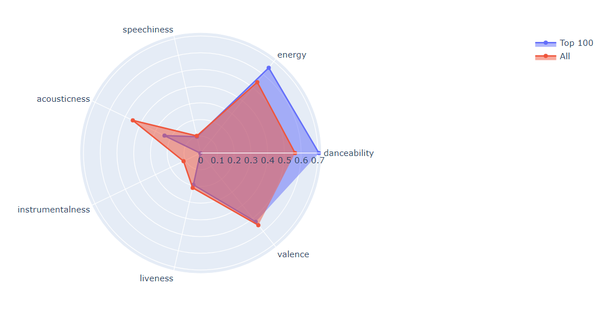
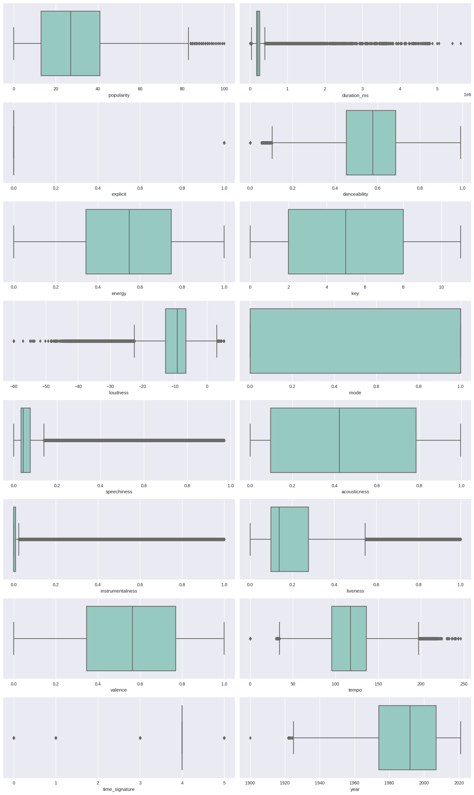

# Spotify Music Popularity Prediction

## Table of content
1. [Introduction](#1)
2. [Data Exploration](#2)
3. [Data Visualization](#3)
    - [What is the overall trend and impact of notable events on the music industry?](#3.1)
    - [Who are the most popular artists?](#3.2)
    - [Which are the most popular songs in the dataset?](#3.3)
    - [What characteristics most clearly characterize a popular song?](#3.4)
    - [Univariate Analysis](#3.5)
    - [Outliers Detection](#3.6)
    - [Bivariate Analysis](#3.7)
4. [Feature Selection](#4)
5. [Pipeline Building](#5)
6. [Model Building](#6)
    - [Logistic Regression](#6.1)
    - [XGBoost](#6.2)
    - [Random FOrest](#6.3)

<a id="1"></a>
## Introduction
Spotify provides APIs for accessing information from its music database. Spotify is a well-known dataset in the data science industry for learning predictive modeling. We used over 600,000 Spotify tracks with their attributes in our project. Each song has 20 columns, each of which describes a different component of the song. We are attempting to optimize several business challenges and expect that our inquiry will reveal some business-related insights.
This report will attempt to assess the value of Spotify data.

<a id="2"></a>
## Data Exploration

This collection includes audio metadata for over 600,000 Spotify tracks. Each column focuses on a different facet of the song. The following is a description of them.

-	`id`: Spotify's unique identifier for each track (randomly generated alphanumeric string).
-	`popularity`: The popularity of a song is measured on a normalized scale of [0-100], with 100 being the most popular.
-	`duration_ms`: track duration in milliseconds.
-	`explicit`: whether or not the song contains explicit content.
-	`artists`: the artist's name.
-	`id_artists`: Spotify's unique identification for each artist.
-	`release_date`: When the album was released (date format: yyyy/mm/dd).
-	`danceability`: indicates a track's suitability for dancing based on a variety of musical aspects such as tempo, rhythm stability, beat strength, and overall regularity. A value of 0.0 indicates that it is the least danceable, while 1.0 indicates that it is the most danceable.
-	`energy`: Energy is a perceptual measure of intensity and activity that ranges from 0.0 to 1.0. Typically, energetic tracks have a quick, loud, and boisterous vibe to them.
-	`key`: The estimated overall key of the track. Integers are assigned to pitches using conventional Pitch Class notation. For example, 0 equals C, 1 equals C/D, 2 equals D, and so on. If no key was found, the value is set to -1.
-	`loudness`: The overall volume of a track measured in decibels (dB). Typical values vary between -60 and 0 dB.
-	`mode`: The mode of a recording (major=1 or minor=0) denotes the type of scale from which its melodic content is formed.
-	`speechiness`: Speechiness is a value from 0.0 to 1.0 that shows how many spoken words are in a track. If a song's Speechiness is above 0.66, it probably has spoken words. If it is between 0.33 and 0.66, it could have both music and words. If it is below 0.33, it does not have any words.
-	`acousticness`: a confidence scale ranging from 0.0 to 1.0 indicating whether or not the track is acoustic. 1.0 indicates a high degree of certainty that the track is acoustic.
-	`instrumentalness`: The number of vocals in the song is represented by the instrumentalness, which ranges from 0.0 to 1.0. The closer to 1.0 it is, the more instrumental the music.
-	`liveness`: The possibility of an audience being present in the recording ranges from 0.0 to 1.0. Higher liveness numbers indicate a greater likelihood that the track was performed live.
-	`valence`: Valence is a scale from 0.0 to 1.0 that describes the melodic positivity expressed by a song.
-	`tempo`: A track's overall approximate tempo in beats per minute (BPM)
-	`time_signature`: A track's estimated total time signature. The time signature (meter) is a notational convention that specifies the number of beats in each bar (or measure).

Some of the dataset's initial songs


**Key Findings:**
As we can see, the Spotify company defines the terms "id" and "id_artist" in an extremely specific way, so we may delete them later because we cannot use them in our machine learning models. The release_date field has inconsistent data, implying that the formatting is erratic. Some columns, for example, have dates in the format YYYY-MM-DD, whereas others only have the format YYYY. As a result, we must concentrate on the consistency of this data; formatting will follow later. While most qualities have a limited range of values, the duration_ms has a much wider range, extending up to almost 300,000. We must scale the duration_ms afterwards to guarantee that our machine learning models work properly. The loudness must also be scaled because it contains negative numbers.

Structure of the data


**Key Findings:** 
According to the data structure, there are six features with integer values, nine features with floating values, and five features with categorical data. In total, we have 15 numerical characteristics and 5 category attributes. The 'name' feature appears to be lacking some information as well. Because the "name" characteristic is different between songs and the number of missing values is small, we may gradually eliminate those missing values.

Summary statistics


**Key Findings:**
The popularity column runs from 0 to 100, with an average of 27, showing that the majority of songs are not popular and that the data is skewed to the right. The smallest value in the explicit column is 0, the maximum value is 1, and the average value is 0.04, showing that the majority of the songs are not explicit and that the data is clearly skewed to the right. Speechiness, instrumentality, and liveness numbers are skewed to the left.

<a id="3"></a>
## Data Visualization

<a id="3.1"></a>
### What is the overall trend and impact of notable events on the music industry?


**Key Findings:** 
This graph shows how the popularity of music has grown over time, indicating how the current generation is more inclined to listen to music and how digitization has benefited the music industry. We can also conclude that the terrorist attacks in 2001 had a substantial detrimental impact on the music industry because the graph shows a steep fall in 2021. The entertainment industry thrives during the covid epidemic, and people want to listen to music more, so the covid pandemic benefits the music industry.

<a id="3.2"></a>
### Who are the most popular artists?

Bar Plot of the most popular artists


Word Cloud for the most popular artists


**Key Findings:**
In this graphic, the size of the word represents how frequently it appears. This contains information about well-known musicians. The magnitude of the name "Francisco Canaro" in the upper left corner, for example, indicates popularity. The song "Die Drei???" has the largest size, indicating that it, along with "TKKG Retro-Archiv" and "Benjamin Blümchen," is the most frequently replayed. We are also familiar with well-known musicians such as Frank Sinatra and Elvis Presley.

<a id="3.3"></a>
### Which are the most popular songs in the dataset?


**Key Findings:**
Based on the results, the most popular songs are “Peaches” of Justin Bieber (2021). This song received the MTV Video Music Award for Best Pop and was nominated for the Grammy Award for Song of the Year. Other songs, such as "Astronaut in the Oceans" and "Binding Lights," are well-known worldwide. Talented performers such as Masked Wolf and The Weekend perform them.

<a id="3.4"></a>
### What characteristics most clearly characterize a popular song?



**Key Findings:**
When we compared the most popular songs to all of the songs in the dataset, we discovered that songs with higher energy and danceability tend to become more popular. However, when compared to standard songs, such popular songs lack acousticness and instrumentalness. Tracks released in recent years tend to be more popular.

<a id="3.5"></a>
### Univariate Analysis


**Key Findings:**
We can see that popularity, duration, explicit, speechiness, instrumentalness, liveness is skewed right. loudness, mode, time_signature are skewed left. Only danceability, energy, valence, tempo have normal distribution. Before we can use the machine learning models, we must transform the left and right skewed features have more symmetrical and bell-shaped distributions.

<a id="3.6"></a>
### Outliers Detection



**Key Findings:**
We can see that there are various features that have a lot of outliers from the boxplots of the variables. They are loudness, speechiness, instrumentality, liveness, duration ms, and pace. By utilizing IQR Ranges to reduce outliers, we can handle them. Or, we may handle them by using Robust Scaler. This scaler additionally employs IQR Ranges, making it extremely resistant to outliers.

<a id="3.7"></a>
### Bivariate Analysis


**Key Findings:**
We may deduce the following facts from the correlation matrix. According to the correlation matrix, there is a strong positive link between energy and loudness, with a score of 0.76. With a score of -0.72, energy and acousticness have a strong negative association. We can utilize the remaining variables to train the machine learning models because they have a good connection.

<a id="4"></a>
## Feature Selection
Based on the column `popularity`, we establish a new variable named `highly_popular` with a threshold of 50. Songs with a popularity rating of more than 50 are highly popular. This will be our target variable for predicting a song's popularity.
After creating this variable, we drop the column `popularity` and check the number of unique values the column `highly_popular` has. 


**Key Findings:** 
We have 510,758 unique values of class 0 and 75,843 unique values of class 1. We can see that the number of class 0 is 5 times more than the number of class 1. This is unbalanced data. To balance them, we must employ the Resampling approach. But before that, we need to split the target variable from predictors.

We first split the target variable (`highly_popular``) into X and y matrices. Then the **RandomOverSampler** module is used to select observations from the dataset at random as long as they have the same number of classes. Therefore, we have 75,843 observations of class 0 and 75,843 observations of class 1. They are transformed into balanced data.

<a id="5"></a>
## Pipeline Building

Pipeline for ML models (XGBoost for example)


<a id="6"></a>
## Model Buiding

<a id="6.1"></a>
### Logistic Regression

```
Classification Report:
              precision    recall  f1-score   support

           0     0.7016    0.6679    0.6843    101950
           1     0.6844    0.7171    0.7003    102382

    accuracy                         0.6925    204332
   macro avg     0.6930    0.6925    0.6923    204332
weighted avg     0.6929    0.6925    0.6923    204332


ROC AUC Score: 0.6924826550162668
```


The `explicit`, `loudness`, and `danceability` of the songs contribute most to their popularity. At the same time, `valence`, `acousticness`, and `enery` are qualities that make the music less popular. So, in order for a song to be successful, it must have a good combination of these traits.

<a id="6.2"></a>
### XGBoost

```
Classification Report:
              precision    recall  f1-score   support

           0     0.7526    0.7116    0.7315    101950
           1     0.7276    0.7671    0.7468    102382

    accuracy                         0.7394    204332
   macro avg     0.7401    0.7394    0.7392    204332
weighted avg     0.7401    0.7394    0.7392    204332


ROC AUC Score: 0.7393506882824059
```


According to the XGBoost model, the most critical factors that determine whether a song is popular or not are `explicit`, `loudness`, `acousticness`, and `valence`. 

<a id="6.3"></a>
### Random Forest

```
Classification Report:
              precision    recall  f1-score   support

           0     0.9908    0.9359    0.9626    101950
           1     0.9395    0.9914    0.9648    102382

    accuracy                         0.9637    204332
   macro avg     0.9652    0.9636    0.9637    204332
weighted avg     0.9651    0.9637    0.9637    204332


ROC AUC Score: 0.9636425776934088
```


Based on the results of the Random Forest model, we can infer whether a song is popular or not based on its `loudness`, `acousticness`, `duration` and `valence`. 


